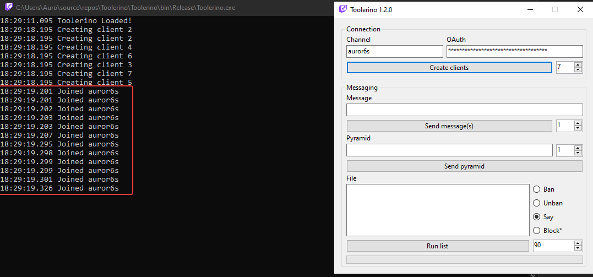

# Toolerino

C# Twitch App to help with spam and banning bots with inspiration from [WetTurtoise's Turtlerino](https://github.com/WetTortoise/turtlerino/)

## How to use the program
1. Download the latest release from the [Releases tab](https://github.com/MrAuro/Toolerino/releases/)
2. Extract the downloaded zip to a safe location and run the `Toolerino.exe` inside of there
3. A console and a form will popup. Put your [OAuth](https://twitchapps.com/tmi) in the OAuth textbox and channel and click create connections.
    - Wait for all of the connections to join the channel:
    
4. All good to go! Your OAuth will be saved so you don't have to manually input it everytime

**If you need any help, feel free to ask in my Twitch chat, #auror6s**

## Rate Limits
I recommend you read Twitch's IRC rate limits which are available [here](https://dev.twitch.tv/docs/irc/guide#command--message-limit)

A normal user account has rate limits of **20/30s**. This means 20 requests for every 30 seconds. Moderators and broadcasters have higher limits, at **100/30s**. Verified bots have limits of **7500/30s**, which allows them to send messages really quickly, for a long amount of time

Below are some of my recommendations for the rate limit inputs (connections and chunk size for filesays)

|             | Normal Users | Verified Bots |
|-------------|--------------|---------------|
| Connections | 10           | 30            |
| Chunk Size  | 90           | 2000          |

If you have a list of strings in the filesay box and it is over the chunk size, it will be chunked. So 90 (or 2000) messages will be sent, then it will wait 30 seconds before doing the next chunk. You can view the status of a chunked list in the console or the progress bar below.

---

**If you find a bug or a problem, please [create an issue](https://github.com/mrauro/toolerino/issues) (make sure someone else doesn't have a similar problem by using the search box)**

Also feel free to create a pull request if you want to help contribute to the project!